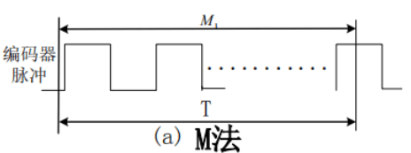
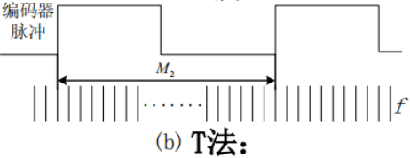
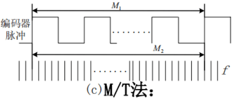

# 编码器

旋转编码器(rotary encoder)是将旋转位置或旋转量转换成模拟或数字信号的机电设备，一般安装在旋转物体中垂直旋转轴的一面。  
旋转编码器可以分为绝对型(absolute)编码器和增量型(incremental)编码器两种。  
具体介绍请自行查看百科[旋转编码器](https://zh.wikipedia.org/wiki/%E6%97%8B%E8%BD%89%E7%B7%A8%E7%A2%BC%E5%99%A8)

## 1-1 队内编码器介绍

队内常用编码器如下：
|队内俗称|编码器类型|编码器线数|厂商|
|:-:|:-:|:-:|:-:|
|光电编码器|增量式|1000|
|小增编|增量式|4096|Accnt|
|小磁编|增量式|4096|Accnt|
|大增编|增量式|||
|方形编码器(AS5047)|绝对式&增量式|1000|永钢|
|大绝编|绝对式|||

①光电编码器用于原本的RE电机和EC电机，其他电机不再使用。此种编码器简单经济，不过我们的接线方式非常容易掉，易发生危险。
②小增编是19年开始使用的一种磁编码器，依靠检测磁场方向得到编码器脉冲。当时用于大四足U10电机。但因其自带轴“大屁股”空间占用较大为之诟病。现在已经基本弃用。  
③小磁编是在小增编基础上依然在Accnt购买的一款不带外壳的磁编。需要自行用打印件安装。  
④大增编  
⑤方形编码器是从永钢买的用于VESC的绝对值编码器，自带5V及3.3V转换接口。  
⑥大绝编用于19年发射拐骨那辆车的底盘转向电机。

## 1-2 基于脉冲式编码器的测距、测速和测加速度方法

伺服电机控制时需要获得其准确的电流、速度及位置信息。通常使用电调或驱动器会有运行信息反馈。但有时会有例外，比如大多数都不会反馈绝对距离而是单圈脉冲，比如RM6025不会反馈速度信息。更退一步，当使用自己的电机驱动板控制电机时，需要自行计算所有参数。  
而编码器是最常用的位置传感器，通过一定的处理可以获取想到的数据。

### Ⅰ测距

假设编码器每转脉冲数为P，时钟频率为f，M1，M2分别是对编码器脉冲和时钟脉冲进行计数的计数值。  
通过计算两次定时器频率之间的编码器脉冲数误差，并在时间尺度上累计，便可得到总编码器脉冲数，并换算到电机轴后总圈数。  
$$M_1 =\int^{T}_{0}{\Delta M_1dt}$$
唯一需要注意的只是编码器数值溢出如何处理。
$$if\quad|\Delta M_1|>\frac{P}{2}\qquad\qquad\Delta M_1-=sgn(\Delta M_1)*P$$
由此可知电机最大速度$V_{max}\leq\frac{60f}{2}$

### Ⅱ测速

#### 1.M法

通过测量一段固定的时间间隔内的编码器脉冲数来计算转速，使用与高速场合。  
设在固定时间T内测得的编码器脉冲数为M1，则转速$N=\frac{60M_1}{PT}$，其相对误差为$|\frac{\Delta N}{N}|=|\frac{\Delta M_1}{M_1}|$  
当速度越慢时，相对误差越大。

#### 2.T法

通过测量编码器两个相邻脉冲的时间间隔来计算转速，适用于速度比较低的场合，当转速较高时其准确性较差。  
转速$N=\frac{60f}{PM_2}$，其相对误差为$|\frac{\Delta N}{N}|=|\frac{\Delta M_2}{M_2 +\Delta M_2}|\approx \frac{\Delta M_2}{M_2}$  

#### 3.M/T法

“M/T法”是前两中方法的结合，同时测量一定个数编码器脉冲和产生这些脉冲所花的时间，在整个速度范围内都有较好的准确性。  
但对于低速情况下，该方法需要较长的检测时间才能保证结果的准确性。
通常时钟频率f远大于编码器的输出脉冲频率，因此上面各式中M2远大于M1。

### Ⅲ测加速度

加速度测量可以直接使用$\frac{\Delta V}{\Delta T}$进行计算，但这样误差较大，可以用多个速度点先进行最小二乘法拟合直线再计算斜率。
