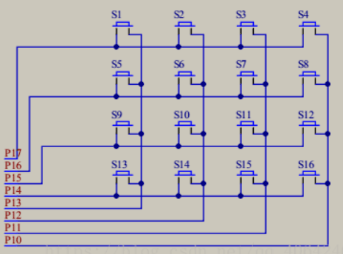
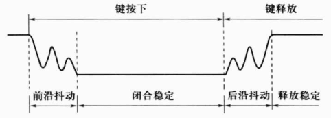
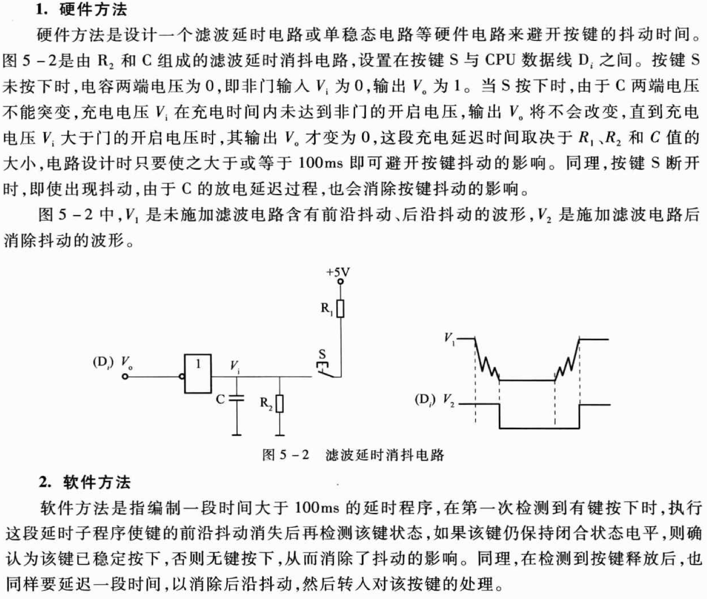

# 矩阵键盘

>key.c

矩阵键盘又叫行列式键盘，是用I/O口线组成的行、列矩阵结构，在每根航线与列线交叉处，二线不直接相通二十通过一个按键跨接接通。采用这种矩阵结构只需M根行输出线和N根列输出线，就可以连接M×N个按键。通过键盘扫描程序的行输出和列输入就可以确认按键的状态，再通过键盘处理程序便可识别键值。

  

4×4矩阵键盘电路  

按键的抖动会造成一次键产生的开关状态被CPU误读几次。为了使CPU能正确地读取按键状态，必须在按键闭合或断开时，消除产生的前沿或后沿抖动，去抖动的方法有硬件方法和软件方法两种。

  

需要注意的是，通过定时扫描方法在一次按键动作中会获得多次值，所以只能把按键设置为标志位，和串口屏的一次按键一次指令不同。 
这样有一个比较好玩的实现，按下电机的时候电机会转，不按电机不动。快乐！  
想要实现串口屏那样按键形式需要在程序里面进行实现。

>曾经没有串口屏的日子，那是矩阵键盘陪我起舞。
