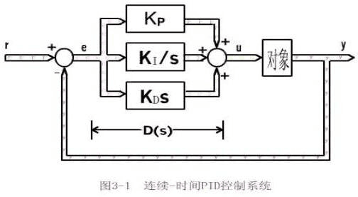
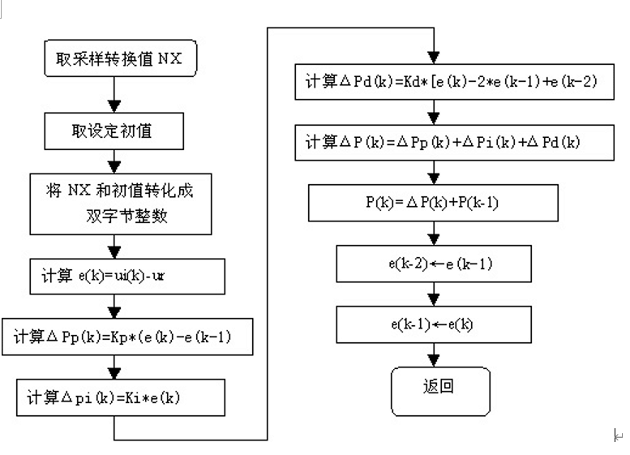
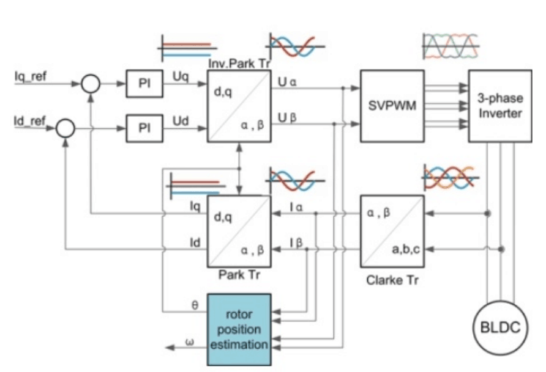
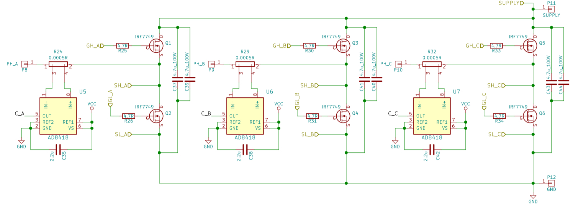

# 算法

## PID算法

### PID控制算法

  

1. PID是一个闭环控制算法。因此要实现PID算法，必须在硬件上具有闭环控制，就是得有反馈。比如控制一个电机的转速，就得有一个测量转速的传感器，并将结果反馈到控制路线上，下面也将以转速控制为例。
2. PID是比例(P)、积分(I)、微分(D)控制算法。但并不是必须同时具备这三种算法，也可以是PD,PI,甚至只有P算法控制。我以前对于闭环控制的一个最朴素的想法就只有P控制，将当前结果反馈回来，再与目标相减，为正的话，就减速，为负的话就加速。现在知道这只是最简单的闭环控制算法。
3. 比例(P)、积分(I)、微分(D)控制算法各有作用：  
   比例，反应系统的基本（当前）偏差e(t)，系数大，可以加快调节，减小误差，但过大的比例使系统稳定性下降，甚至造成系统不稳定；
   积分，反应系统的累计偏差
   $$∑e(t)=e(t)+e(t-1)+e(t-2)+...+e(1)$$
   ，使系统消除稳态误差，提高无差度，因为有误差，积分调节就进行，直至无误差；  
    微分，反映系统偏差信号的变化率
    $$e(t)-e(t-1)$$
    ，具有预见性，能预见偏差变化的趋势，产生超前的控制作用，在偏差还没有形成之前，已被微分调节作用消除，因此可以改善系统的动态性能。但是微分对噪声干扰有放大作用，加强微分对系统抗干扰不利。  
    积分和微分都不能单独起作用，必须与比例控制配合。
4. 下面将常用的各种控制规律的控制特点简单归纳一下：  
   + 比例控制规律P：采用P控制规律能较快地克服扰动的影响，它的作用于输出值较快，但不能很好稳定在一个理想的数值，不良的结果是虽较能有效的克服扰动的影响，但有余差出现。它适用于控制通道滞后较小、负荷变化不大、控制要求不高、被控参数允许在一定范围内有余差的场合。如：金彪公用工程部下设的水泵房冷、热水池水位控制；油泵房中间油罐油位控制等。
   + 比例积分控制规律(PI)：在工程中比例积分控制规律是应用最广泛的一种控制规律。积分能在比例的基础上消除余差，它适用于控制通道滞后较小、负荷变化不大、被控参数不允许有余差的场合。如：在主线窑头重油换向室中F1401到F1419号枪的重油流量控制系统；油泵房供油管流量控制系统；退火窑各区温度调节系统等。
   + 比例微分控制规律(PD)：微分具有超前作用，对于具有容量滞后的控制通道，引入微分参与控制，在微分项设置得当的情况下，对于提高系统的动态性能指标，有着显著效果。因此，对于控制通道的时间常数或容量滞后较大的场合，为了提高系统的稳定性，减小动态偏差等可选用比例微分控制规律。如：加热型温度控制、成分控制。需要说明一点，对于那些纯滞后较大的区域里，微分项是无能为力，而在测量信号有噪声或周期性振动的系统，则也不宜采用微分控制。如：大窑玻璃液位的控制。
   + 例积分微分控制规律(PID)：PID控制规律是一种较理想的控制规律，它在比例的基础上引入积分，可以消除余差，再加入微分作用，又能提高系统的稳定性。它适用于控制通道时间常数或容量滞后较大、控制要求较高的场合。如温度控制、成分控制等。

    鉴于D规律的作用，我们还必须了解时间滞后的概念，时间滞后包括容量滞后与纯滞后。其中容量滞后通常又包括：测量滞后和传送滞后。测量滞后是检测元件在检测时需要建立一种平衡，如热电偶、热电阻、压力等响应较慢产生的一种滞后。而传送滞后则是在传感器、变送器、执行机构等设备产生的一种控制滞后。纯滞后是相对与测量滞后的，在工业上，大多的纯滞后是由于物料传输所致，如：大窑玻璃液位，在投料机动作到核子液位仪检测需要很长的一段时间。  
    总之，控制规律的选用要根据过程特性和工艺要求来选取，决不是说PID控制规律在任何情况下都具有较好的控制性能，不分场合都采用是不明智的。如果这样做，只会给其它工作增加复杂性，并给参数整定带来困难。当采用PID控制器还达不到工艺要求，则需要考虑其它的控制方案。如串级控制、前馈控制、大滞后控制等。  
公式：  
比例(P)控制器  
$$u(t)=K_pe(t)$$  
比例积分(PI)控制器  
$$u(t)=K_p[e(t)+\frac{1}{T_I}\int^{t}_{0}e(\tau)d\tau]$$  
比例积分微分(PID)控制器  
$$u(t)=K_p[e(t)+\frac{1}{T_I}\int^{t}_{0}e(\tau)d\tau+T_D\frac{d(e(t))}{dt}]$$  
*式中&nbsp;&nbsp;&nbsp;&nbsp;K_p——比例放大系数；T_I积分时间；T_D微分时间。*

### 数值pid的计算

**标准的世界计算法公式：**  
$$Pout(t)=K_p*e(t)+K_i*\Sigma e(t)+K_d*[e(t)-e(t-1)];$$  
**上一次的计算值：**  
$$Pout(t-1)=K_p*e(t-1)+K_i*\Sigma e(t-1)+K_d*[e(t-1)-e(t-2)];$$  
**两式相减得到增量法计算方法：**  
$$Pdlt=K_p*(e(t)-e(t-1))+K_i*e(t)+K_d*[e(t)-2*e(t-2)+e(t-2)];$$  

+ 问题：Kp,Ti,Td三个参数的设定是PID控制算法的关键问题。一般说来编程时只能设定他们的大概数值，并在系统运行时通过反复调试来确定最佳值。因此调试阶段程序须得能随时修改和记忆这三个参数。
+ 参数的自整定。在某些应用场合，比如通用仪表行业，系统的工作对象是不确定的，不同的对象就得采用不同的参数值，没法为用户设定参数，就引入参数自整定的概念。实质就是在首次使用时，通过N次测量为新的工作对象寻找一套参数，并记忆下来作为以后工作的依据。

位置式PID和增量式PID在计算结果上并无区别，只是在定时器计算中将原本的输出改为每次相加。即位置式：out = Pout或增量式out += Pdlt；

### PID算法流程图

  

## FOC

前置文章学习： 
[深入浅出讲解FOC算法与SVPWM技术](https://zhuanlan.zhihu.com/p/147659820
)
参考书籍：
现代永磁同步电机控制原理及MATLAB仿真
SVPWM的原理及法则推导和控制算法详解

FOC框架如下图所示

  

一、配置编码器获取角度值

我只配置绝对值编码器，SPI读取数值。程序内也默认运行在这种条件下。  
采用IO口模拟SPI通信，这种方式移植性强。

二、对电机三相电流进行采样得到
$$\it{I_a, I_b, I_c}$$  

原理上采样两相电流即可，但为精确性而言，可以采样三相电流，去除绝对值最大的一项，再利用基尔霍夫定律计算第三相电流。  
电流采样可以采用电机预驱动器芯片，也可以自己用模数转换芯片采样。  

  

如上图所示，实际情况中采样的是加载到一个电阻两端的电压。  
本杰明采样AD8418芯片进行采样，其内部设定电流增益为20(详见芯片手册)，并联电阻为0.0005欧,参考电压为3.3V。  
故从采样值(消除零偏后)到电流值的转换为  
$$I=data*\frac{\frac{3.3}{4095}}{20*0.0005}A$$  

三、电流误差经过电流环得到控制电压
$$\it{U_q, U_d}$$

这里值得一提的是，我并没有具体研究FOC相关的电气知识。比如电流环检测，编码器检测，还有速度跟踪器等。  
一些参数我都是默认的。比如编码器的补偿角度，电机电阻、电感等参数，电流环的PI，观测器增益。这些对于不同的电机都要进行不同的选择。  
目前来说我是对一个电机参数用本杰明上位机测出来，然后修改程序里面的参数，详见motor_defalut，里面我标双星号的都是要改的。  
对于电机的一些参数，这些可以写进一个结构体里面，其实同一款电机参数相差无几，一般不追求极致性能的话一种电机记录一种就可以了，然后可以保存在结构体里面类似咱们的电机程序。  
唯一需要攻克的就是编码器检测，这个暂时我并未做相关工作，也可以用，就是有些麻烦。

四、反Park变换得到
$$U_\alpha , U_\beta$$
, 通过SVPWM输出至电机  

关于SVPWM，具体见上面的那个书籍，讲的挺详细的。

## 数字滤波

数字滤波是计算机系统对输入信号采样多次，然后用某种计算方法进行数字处理，以削弱或滤除干燥噪声造成的随机误差，从而获得一个真实信号的过程。这种滤波方法只是根据预定的滤波算法编制相应的程序，实际上是一种程序滤波。

### 几种简单的数字滤波

一、平均值滤波  
    平均值滤波就是对多个采样值进行平均计算。

1. 算术平均值滤波

    在采样周期T内，对测量信号y进行m次采样，把m个采样值相加后的算术平均值作为本次的有效采样值  
    $$\bar{y}(k)=\frac{1}{m}\sum_{i=1}^n y_i$$  
    采样次数m决定了信号的平滑度和灵敏度，这两者是相互矛盾的。

2. 去极值平均滤波

    在算术平均值滤波的基础上去掉极值，排除明显的偶然的脉冲干扰。

3. 加权平均滤波

    在算术平均值滤波的基础上添加权值系数。
    一般加权系数从小到大，可选用不同的基础函数，如（0.1, 0.2, ... , 1）或e^(-iτ)

4. 滑动平均滤波

    在算术平均值滤波的基础上，采用队列存储数据。避免平均滤波算法每次为取得一个有效采样值必须连续进行若干次采样的缺点。
    可在SPI读取编码器是采用此种方法。（需要较大的采样频率）

二、中值滤波  

将信号y的连续m次采样值按大小进行排序，取其中间值作为本次的有效采样值。一般m为奇数，三五次即可。  
中值滤波对缓变过程中的偶然因素引起的波动或采样器不平稳造成的误差所引起的脉动干扰比较有效，而对快速变化过程的信号采样不适用。

三、限幅滤波  

根据经验，实际情况中有些物理量在一定的采样间隔内不可能有太大的变化，故将幅度限制在一定范围内截断。

四、 惯性滤波

模拟硬件RC低通滤波器。
常用RC滤波器传递函数为
$$\frac{Y(s)}{X(s)} = \frac{1}{1+T_f s}$$  
写成差分方程  
$$Tf\frac{y(k)-y(k-1)}{T}+y(k)=x(k)$$  
整理得  
$$y(k)=\frac{T}{T_f+T}x(k)+\frac{T_f}{T_f+T}y(k-1)=ax(k)+(1-a)y(k-1)$$  
式中  
a——滤波系数，a=T/( T_f +T)  
T——采样周期  
T_f——滤波环节的时间常数

### 卡尔曼滤波

>公式推导详见卡尔曼滤波原理及应用-第三章

学习的卡尔曼滤波是多维的，但实际应用时，比如DT采样得到的数据只是一个单一独立的变量。在代码里面实现的也只是一维卡尔曼滤波，实现较为简单。  
卡尔曼滤波拟合的曲线是线性连续的，故而无法跟踪跳变信号，如DT扫描时经过一个物体突然照到远处，这是数据跳变过大，需要进行幅值检测，否则数据处理跟随较慢。

## 神经网络

## 模糊控制

## ANFIS

(Adaptive Neuro-Fuzzy Inference System)ANFIS，自适应模糊神经网络，其实就是将神经网络的模型
