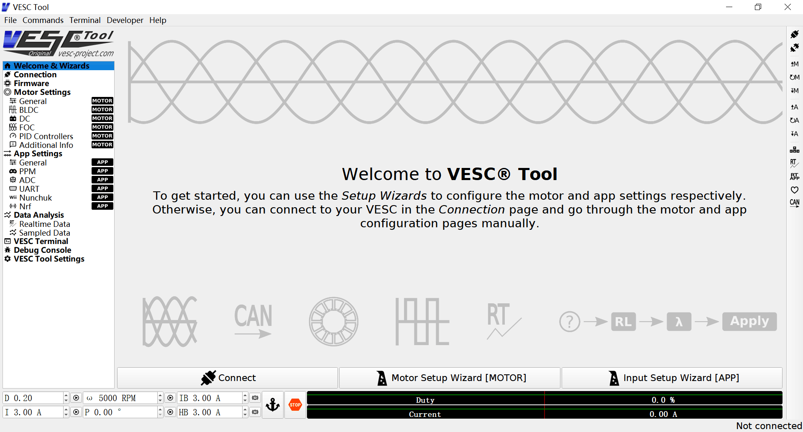
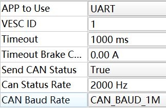
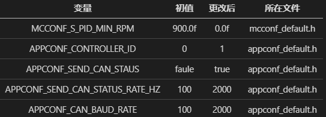
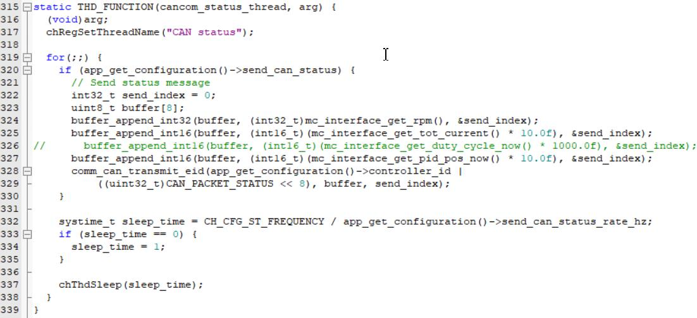
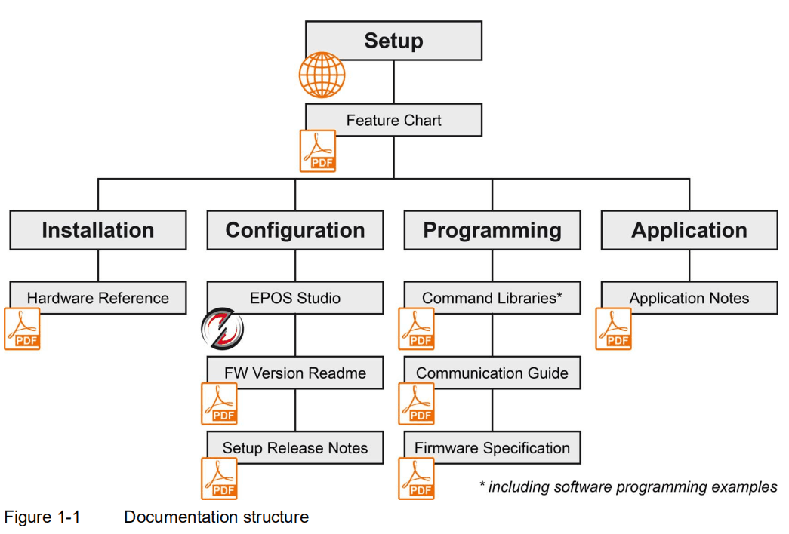
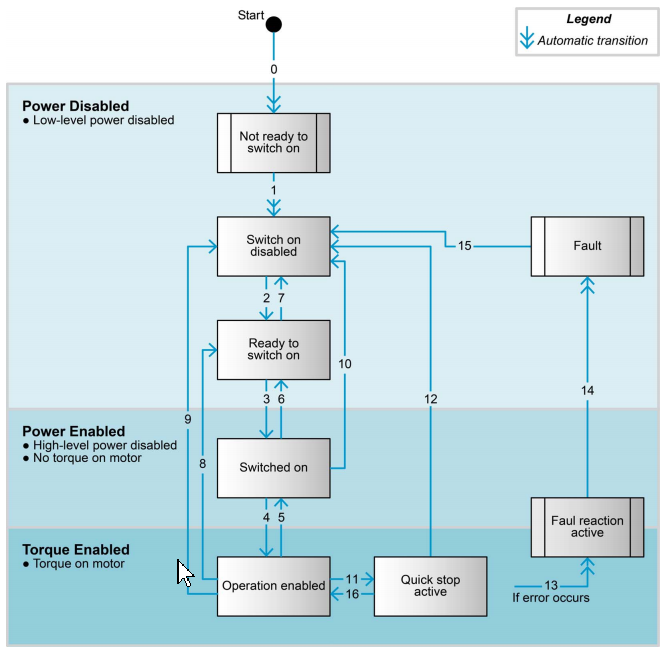
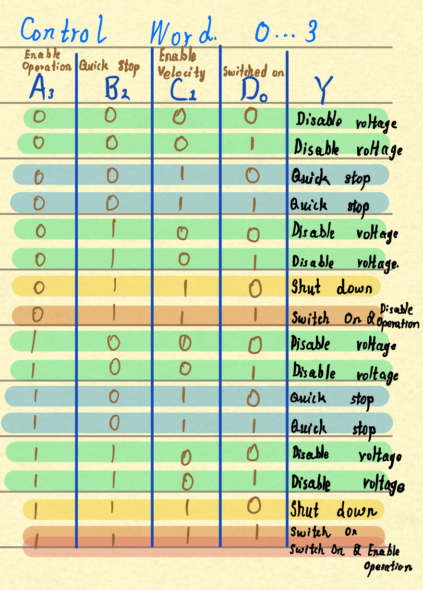
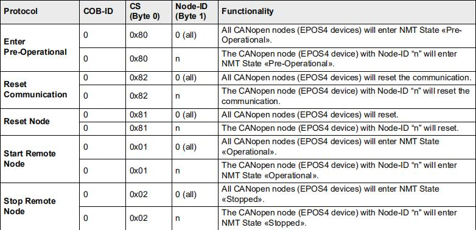

# 驱动器

## DJESC

DJ电调是一款新手友好型电调，与电机配套使用（M2006+C610，M3508+C620，RM2025+？？？）。  
具体介绍查看官方文档。

因其输入只为控制电流值，其他控制系统需要在程序内自行编写，但在另一方面这又给了我们极高的自由度去设计自己的控制程序。

注意事项：

+ DJ电机电流是一起发的，包括所有电机。所以多个板子控制电机的时候不要将can2线连在一起
+ DJ电机开始位置记录因为在`pulse_caculate()`函数里面开始distance会先运行一次才会在对`valuePrv`进行赋值，所以会有`0~8192`的脉冲误差（已尝试解决一部分误差）
+ 将电机使能放在了start里面以达成延时使能的要求从而避免初始位置误差  
+ 2006发送can报文的频率大概是`0.5-1.7ms`，一圈脉冲数是8192，那么按照1.5ms一条报文来算，`阈值设定为4100`允许的最大速度比较大，在19970rpm左右，如果速度过大，则由于阈值的原因将会无法判断电机的转向。所以对于2006来说，速度不要超过19500,否则角度偏差会比较大(之前写转向程序就出过角度丢失的现象)，另外3508转速低阈值基本来说随便给= =
+ 理论一个板子可以同时控制8个电机，实际上有一定风险，最好不要超过6个电调在同一条总线上

---

## ELMO

---

## VESC

 
 

VESC电调是由Benjamin Vedder研究并开源的一款强大的电机电子调速器。电流最高可达100+A（具体多少忘了），但电流过高会烧驱动器，有过先例！！所以最高一般80A足以，远高于以前的ELMO驱动器。  
VESC常用于速度控制场合，如航模，滑板车电机控制，电调带有三环控制，但其自己的位置控制只允许在360°范围内进行旋转，多有不便。如想实现常用位置控制需在代码层进行实现。  
VESC电调有诸多款，当前队内购买的主要为VESC6。

### ㈠上位机

BLDC Tool VESC 电调调试工具是一款运行在windows下的本杰明电调的调试工具，在对VESC开源电调进行调试时需要使用到这个程序，支持BLDC 和FOC，支持更新固件，需要使用COM串口（安卓线）进行连接后再调试。  
目前队内常用的上位机版本为vesc_tool_0.95，该版本上位机较老，功能较少，但可满足当前的需求。该版本上位机操作界面如图所示：

>初学者请先看完 *(学习资料\机构\VESC驱动器\VESC工具\0.VESC工具手册_ VESC项目.pdf等6个文件)*

了解以下界面的功能操作

1. Wizards 向导界面

    **注意事项:**  
    ①需要等到本杰明板初始化完成（灯亮再灭）才可正常连接，有时J-link和USB一同插在集线器上会无法连接，这时候需先拔掉J-link待连接成功后再重新插入。  
    ②电机上电时，若该电机无法通过方向键正常运转，但已有过整定参数，需注意应先给板子刷一遍默认参数，再将mc.xml下载至本杰明板，之后在FOC->Encoder界面再检测一次编码器就好。  
    ③电机三相电插在本杰明电源输出口的时候之前并管过线序，它只会影响同一电流输入后的电机转向。
    但编码器的正转方向是固定的，本杰明固件内的程序电流输出方式也是固定的。
    以电机输出轴向外，编码器向自己，此时电机逆时针旋转编码器为正向。需要检测电流方向与编码器方向是否同向，若非，则于Motor Settings -> General -> General -> Invert Motor Direction进行更改。否则PID会出错。

2. Motor Settings 电机设置界面

    电机设置需根据不同电机设置不同参数，只需关注**General, FOC, PID Controllers，Additional Info**四个界面配置。
    VESC的速度设定是ERPM(电角度转速)=RPM*POLES极对数。还有一个是Minimum ERPM，小于这个转速电机就不运行了。
    有感模式下在速度大于openloop erpm时会切换到无感模式，在上位机把openloop erpm改大。  

3. App Settings 上位机设置界面

    该模块只需关注**General**界面内配置，除ID外，其他基本无需改动。  

      

4. Data Analysis 数据分析界面

    通常只用**Realtime Data**界面，建议使用上位机时先通过该界面检测编码器是否正常工作。

### ㈡固件库

#### 1.所做修改

    我们使用的是VESC固件库keil移植版（淘宝赠送）。根据我们的需求对固件库的一些参数进行了修改：  
    ①占空比反馈改为了位置反馈：--反馈数据为 绝对角度*10，变量类型u16  
    ②变量修改

#### 2.代码分析

+ appconf_default

    上位机配置文件，其内参数对应上位机App Settings

+ comm_can [ CAN通信文件 ]

    `static THD_FUNCTION(cancom_process_thread, arg)`函数是VESC接收报文处理函数，即我们发送的报文。CAN命令详见`CAN_PACKET_ID`枚举结构。  
    `CAN_PACKET_SET_CURRENT: mc_interface_set_current(buffer_get_float32(rxmsg.data8, 1e3f, &ind));`  
    `CAN_PACKET_SET_RPM: mc_interface_set_pid_speed(buffer_get_float32(rxmsg.data8, 1e0f, &ind));`  
    `CAN_PACKET_SET_POS: mc_interface_set_pid_pos(buffer_get_float32(rxmsg.data8, 1e6f, &ind));`

    发送至VESC的报文通信格式须与该文件内定义的格式一致。

    原固件库反馈为rpm &  current & duty;将duty改为pos方便进行位置计算。此处位置为相对角度，仍需累加计算。  
    VESC运行过程中，需持续给其发送报文，否则电调将会断连。

+ digital_filter [ 数字滤波器 ]

    包含常见的几种数字滤波器，可以学习一下。

+ mcconf_default [ 电机配置文件 ]

    其内参数对应上位机Motor Settings

+ mcpwm_foc [ foc算法 ]
  
    采用PID控制为传统的直接计算法，但其中单独对D进行了简单的低通滤波处理。  
    `UTILS_LP_FAST(value, sample, filter_constant)	(value -= (filter_constant) * (value - (sample)))·`

    + control_current [ 电流环 ]

        电流环频率：100kHz
        里面是FOC算法，有兴趣可以了解一下。

    + run_pid_control_speed [ 速度环 ]

        速度环频率：10kHz  

    + run_pid_control_pos [ 位置环 ]

        位置环频率：1kHz
        位置环的输入设置值范围为[0, 360°]
        本杰明的位置环未进行三环嵌套，位置环直接嵌套电流环，也就是说其位置环无法进行速度限制。

+ utils [ 数学函数 ]

    该文件是一个小型的函数集，内含诸多有用的数学工具，建议移植到自己的程序里面。

### ㈢程序

>详见vesc.c & vesc.h

采用电流模式实现的速度环与位置环都根据其数值映射比例放大了相应的PID参数。原VESC PID参数过于小。
VESC需要定时赋值否则会自动释放。  

+ 电流环

    防止实现延时，将电流环报文直接发送，不要放在队列里面

+ 速度环

    速度环目前尝试过两种方法，分别为通过电流模式实现的速度环以及直接使用其速度环。  
    通过电流环的方法暂未成功，目前的思想是先将程序通过电流环的效果与其自身速度环进行一致，完整了解其机理再进行改进。

    + 电流模式实现

    实际操作发现将PID参数与上位机所配置参数进行对应后，PI参数下的电流实际反馈与本杰明电调实际输出相同，但D有些不同。目前怀疑是滤波层次的时间常量不对。我们的定时器频率都是一致的。（还未尝试）

    + 直接速度环

    速度环曲线收敛过慢。目前未清楚原因。  
    同时速度环也较软。

+ 位置环

    防止丢失位置信息，将报文反馈频率设置为2000hz。  
    同理位置环也采用直接位置环、速度环下的位置环以及电流环下的位置环。  

    + 电流模式实现

    速度环下的电流环机理还未明确，故此模式暂且放置。

    + 速度模式实现

    由于本杰明原本的速度环刚性便无法与其位置环相比，通过此方法实现的位置环刚性太差，予以放弃。

    + 直接位置环

    本杰明自身位置环效果刚性很好。
    通过该方式实现的位置环，为进行速度控制，目前采用的方法是在行程的前一部分走速度环，当电机即将达到设定目标时转为位置模式  

---

## EPOS

EPOS是MAXON开发的一款驱动器系列，其中主要为EPOS2和EPOS4，二者控制方式没有区别，而EPOS4体积较小，支持功能更加完善。队内拥有的是5个EPOS4。遗憾的是，EPOS4最大持续电流为15A，峰值电流为30A，偏低，使用时电机速度加不上去，不适用与队内这种粗暴使用情况。其可用作机械臂关节电机驱动器使用，位置伺服性能优良。  

### 官方文档

MAXON作为一个国际上成熟的机电厂商，其EPOS4驱动器拥有极为完善的技术文档。学习过程主要便是看文档。

  

#### EPOS4 Command Liabrary ☆☆☆☆☆

EPOS4驱动器内部函数格式，作用不大

#### EPOS4 Application Notes Collection ★★★★☆

EPOS4驱动器内部函数，算法，原理图，有余力者可以学习

#### EPOS4 Firmware Specfication ★★★★★

里面包含了EPOS的对象字典以及连接方式，报文发送格式从这篇文档里面查看。  
常用的已经写在了`epos.c`里面，见`2.2 Device Control`，需要按照如下图所示步骤发送指令电机才可正常启动。

  

控制字真值表如下所示：

  

#### EPOS4-Communication-Guide-En ★★☆☆☆

主要讲解CAN内PDO，SDO，NMT等

  

#### EPOS4-Module-50-15-Hardware-Reference ★☆☆☆☆

这里面主要包含驱动器各个硬件接口定义，主要为各种线接头以及DIP switch配置用以CAN Node ID，机构组记住下面两项就好  
`3.3.6 DIP Switch Configuration(SW1)`  
`3.5 Status Indicator`

### 上位机

1. View界面打开Navigation示图和Status示图。file里面可以打开以前的.pjm工程文件
2. Communication里面进行连接，也可选择上面的绿色USB图标进行自动连接，如连接未成功，可尝试转换USB COM口
3. Wizards->Starup里面设置电机的基本参数（最后面三个基本用不到）
4. Wizards->Regulation Tuning整定pid。
5. Tools->Object Dictionary对象字典，可查看各数值变量，工具栏三个蓝哭脸可以调整数据刷新频率
6. Tools->Data Recoder即数据观察界面  

+ 位置模式有两种模式，类似于编码器的绝对式和增量式，可以借助代码实践理解。  
    位置模式再到达目标后，若想再次运动必须`再发一次0x0F`
+ 官方提供的halt和quickstop的刹车效果不很理想，平时基本不用，速度模式下的锁位置通过直接更改为位置模式完成。
+ epos没有查询电流的功能，只能查询当前扭矩在除以一个系数算出电流（参数在flat90手册里头）
+ 启动HMM模式，控制字写入`0x1F`，有两个归零速度，一个较快用于寻找机械寻零，一个较慢用来到达索引脉冲
+ HMM模式method设置为`actual method` ，设置当前位置为零点，`offset position 和 homing position均给0`

### 杂谈

值得一提的是，最初调试时出现单个驱动器调试没问题，但四个驱动器同时在总线上工作时会时不时有驱动器报错停止工作。  
解决办法是在CANopen里面将不需要的过滤节点关闭，仅留一个即可发送接收。  
[这个软件每次直接关闭都不行，需要我从任务管理器强制退出，*艹*]

去年调试时使用EC-Flat-90电机，这个电机极容易发热。跑底盘时无法跑多久。虽然不带载测的时候扭矩可达6N·M，但通过示波器实际速度曲线严重偏离设定曲线，跟随不太好，再加之当时时间紧迫，也便没有再进行下去。

---

## ODRIVE
