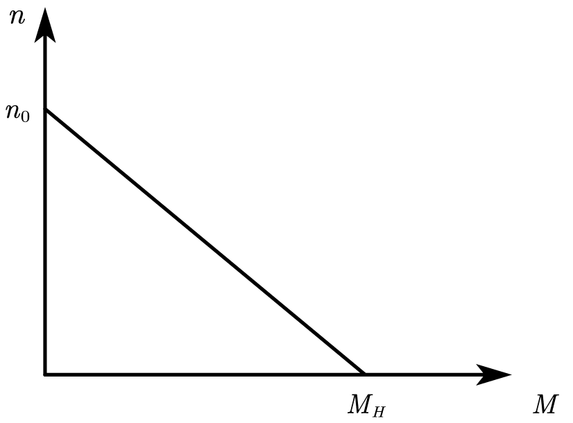

# 电机

## 基础知识

## 电机种类

### DJ

### MAXON

### T-MOTOR

### 舵机

### 月半电机

## 电机选型

>说明：负载惯量和负载转矩的归算参考《机械原理》和《电机、拖动与控制》，转动惯量也可以利用三维建模软件确定

基本公式

1.电磁转矩  
$$M=k_M · I$$  
*kM*——转矩常数  
*I*——电枢电流  

2.电枢反电动势  
$$E=k_n  ·n$$  
*kn*——速度常数  
*n*——电机转速  

2.回路电压方程  
$$U=E+I·R_a$$  
*U*——电机端电压  
*R_a*——回路电阻  

4.机械特性  
$$U=E+I·R_a =k_n ·n+\frac{M}{k_M}·R_a$$  
$$n=\frac{U}{k_n}-\frac{R_a}{k_n k_M}·M$$  

*n-M*曲线图如下：  
  
$$M=0时，n_0=\frac{U}{k_a}(空载转速)$$  
$$n=0时，M_H =k_M ·\frac{U}{R_a}$$  
$$k=\frac{R_a}{k_a k_M}\quad 机械特性（K大代表机械特性软，伺服电机要求K小）$$  

5.最大连续运行转矩  

加速度附加转矩  
$$M_\alpha =J_L·\alpha =J_L ·\frac{\pi}{30}·\frac{dn}{dt}$$  
*J*L——负载转动惯量  
*α*——角加速度  
*n*——负载转速  

各段瞬时转矩  
$$M_n =M_L\pm M_{an}$$  
最大连续运行转矩  
$$M_{RMS}=\sqrt{\frac{1}{t_{tol}}(t_1M_1^2+t_2M_2^2+t_3M_3^2+\cdots+t_4M_4^2)}$$  

### 伺服电机选型方法一

>（参照黄老师的课件和书《伺服电机应用技术》科学出版社，严嘉男 著，索书号TM383.4/Y154）

1、明确负载机构的运动条件要求，即加/减速的快慢、运动速度、机构的重量、机构的运动方式等(*α, v-t, m*)；  
2、根据负载重量、配置方式、摩擦系数、运行效率计算出负载转矩ML；  
3、根据运行条件要求选用合适的负载惯量计算公式，计算出机构的负载惯量JL；  
4、根据负载惯量 与电机惯量 选出适当的假选定电机规格要求
$$\frac{1}{3} J_L< J_R<2J_L(\frac{1}{3}为较优值，对要求不高的系统可降到\frac{1}{10});$$  
5、结合出乎选电机惯量与负载惯量，计算出加速转矩及减速转矩Mα;  
6、初选电机的最大输出转矩必须大于加速转矩+负载转矩 
$$M_H>M_{max}$$
;若不符合条件，须重新选用其他型号电机计算验证至符合要求；  
7、初选电机的额定转矩必须大于连续转矩
$$M_N>M_{RMS}$$
,不符合条件，须重新选用其他型号电机计算验证至符合要求;  
8、完成选型。  

### 伺服电机选型方法二

>参照maxon电机选型指南

1、明确负载机构的运动条件要求，即加/减速的快慢、运动速度、机构的重量、机构的运动方式等(*α, v-t, m, U, Imax*)，**注意伺服放大器有20%左右的压降**；  
2、根据负载重量、配置方式、摩擦系数、运行效率计算出负载转矩ML；  
3、计算出加减速负载转矩Mα;  
4、计算连续负载转矩MRMS;  
5、计算最大功率
$$P_{max}=M_{max}·\eta_{max}$$  
6、据所需扭矩、转速及电机的大致转速范围初选减速器，查到减速器的减速比i和传动效率η;  
7、据减速器的减速比和传动效率计算电机所需的转速、连续运行转矩和最大转矩
$$(n_{mot}=i·n_B\quad M_{mot,RMS}=\frac{M_{RMS}}{i·\eta}\quad M_{mot,max}=\frac{M_{max}}{i·\eta});$$  
8、计算电机的理论空转转速
$$(n_{0,theor}=n_{max}+\frac{dn}{dM}·M_{max});$$  
9、根据电压和理论空转转速计算理论速度常数
$$(k_{n,theor}=\frac{n_{0,theor}}{U})$$  
，若不符合
$$k_{n,theor}<k_n*80\% $$
（要留20%左右的余量）则重新选电机;
10、验算最大电流是否在驱动器允许范围之内
$$(I_{max}=I_0+\frac{M_{max}}{k_M}<I_{max},I_0为空载电流)$$
若不符合重新选电机或者驱动器；  
11、完成选型。  

### 伺服电机选型方法三

使用相应的电机选型软件，软件可以到官网上下载。
